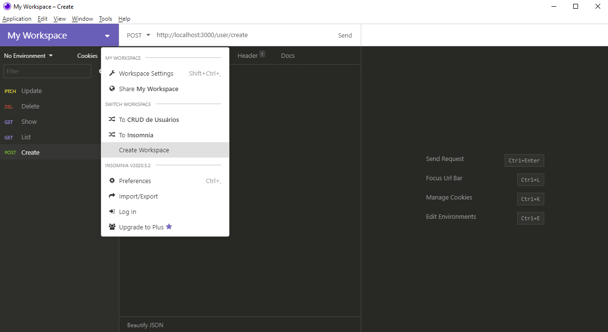
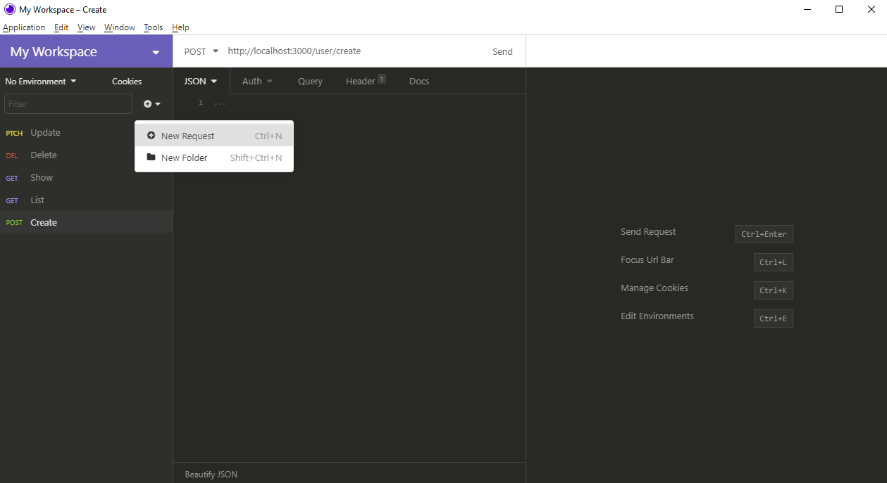
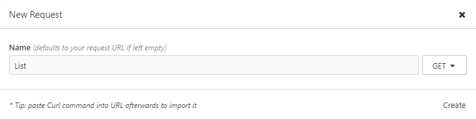
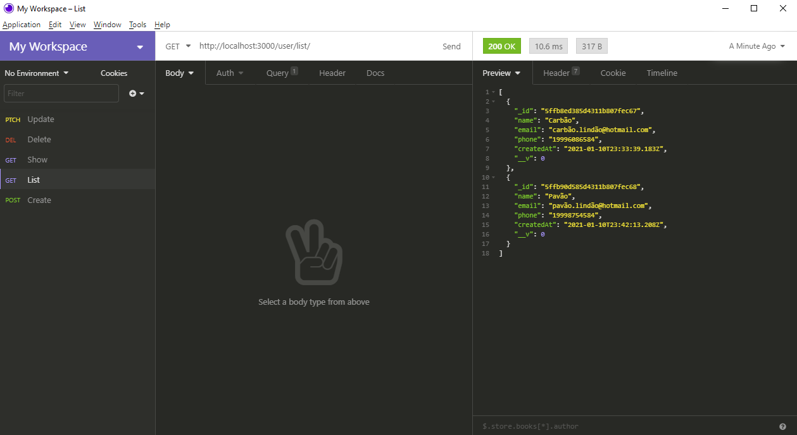

# CRUD de usuários em NodeJS

## Tecnologias utilizadas

- [NodeJS](https://nodejs.org/en/)
- [MongoDB](https://docs.mongodb.com/manual/tutorial/install-mongodb-on-windows/) - Sistema de banco de dados para armazenamento de informações.
- Express - Pacote que faz a tratativa de rotas e requests http.
- Body-Parser - Pacote que faz com que o Node entenda as requisições, recebendo as informações em JSON, e os parâmetros enviados em URL.

## Como executar a API
- Primeiramente, instale o NodeJS e o MongoDB pelos links acima.

- Agora, já dentro de um editor de código (Visual Studio Code, por exemplo) com o diretório que contém a API aberto, instale todos os pacotes utilizando o seguinte comando no terminal:

~~~
npm install
~~~

- Após a instalação dos pacotes, execute o código utilizando o seguinte comando no terminal:

~~~
npm start
~~~

## Como testar as funcionalidades da API

- Por ser uma API Rest, a forma de testá-la é por  meio de requisições HTTP, como GET, POST, DELETE e PATCH. Sendo assim, será necessário o uso de um programa específico para fazer esses tipos de requisições, como por exemplo o [Insomnia](https://insomnia.rest/download/).

### Construindo a estrutura de testes no Insomnia
- Inicialmente, crie um Workspace:

- Em seguida, crie as requisições que serão utilizadas para testar a API:

    - POST (Criar usuário)

    - GET (Listar todos os usuários)

    - GET (Buscar um único usuário)

    - DELETE (Deletar um usuário)

    - PATCH (Atualizar as informações de um usuário)

- Agora, com a estrutura de testes criada, podemos iniciá-los colocando os respectivos **endpoints** no campo de cada requisição.

    - **Criar usuário**: http://localhost:3000/user/create
        - Para essa requisição é necessário fornecer um body com a seguinte estrutura que conterá as informações do usuário a ser criado:

        ~~~
        {
            "name": "Carbão",
            "email": "carbão.lindão@hotmail.com",
            "phone": "19996086584",
            "password": "abcd1234"
        } 
        ~~~
        
        
    - **Listar todos os usuários**: http://localhost:3000/user/list

        

    - **Buscar um único usuário**: http://localhost:3000/user
        - Essa requisição necessita de uma query de nome **userEmail** em que seu valor é o e-mail do usuário a ser buscado:

        

    - **Deletar um usuário**: http://localhost:3000/user
        - Essa requisição necessita de uma query de nome **userEmail** em que seu valor é o e-mail do usuário a ser buscado:

        

        

    - **Atualizar as informações de um usuário**: http://localhost:3000/user
        - Essa requisição necessita de uma query de nome **userEmail** em que seu valor é o e-mail do usuário a ser buscado e de um body contendo a informação do usuário que deve ser atualizada:
            ~~~
            {
                "name": "Carbão Lindão",
                "phone": "19971775025"
            }
            ~~~

        

        

